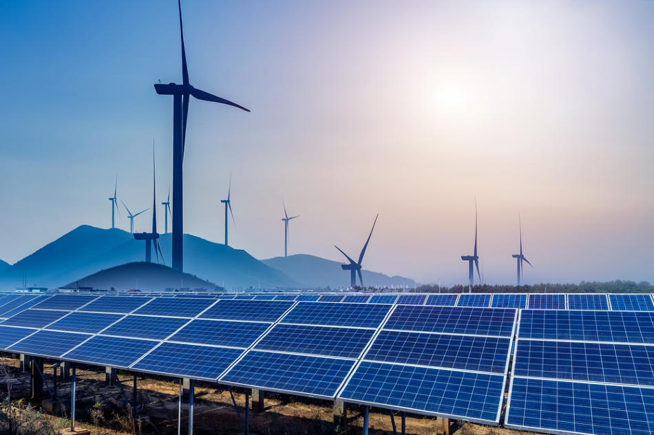
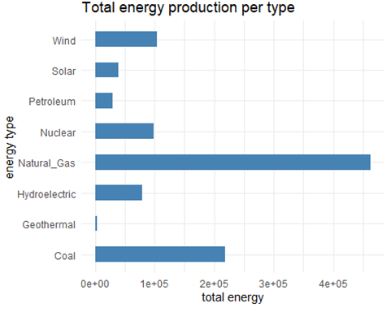
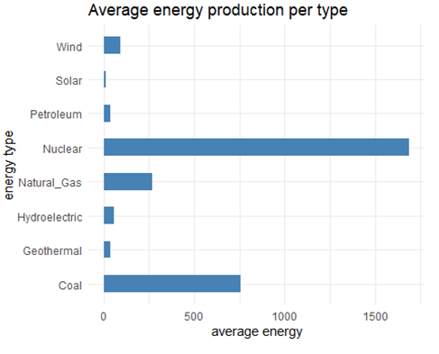
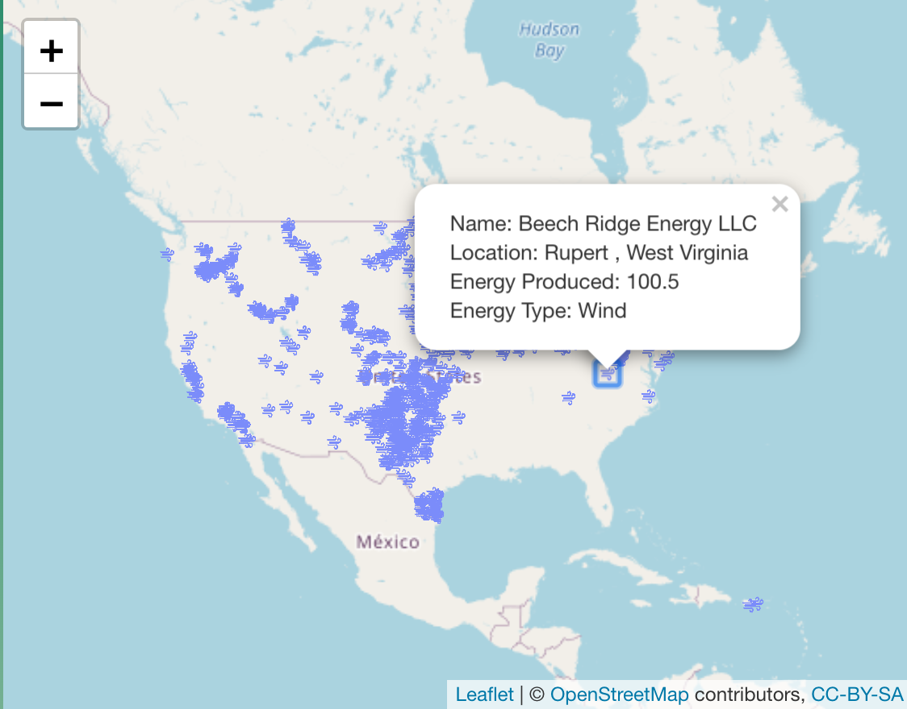
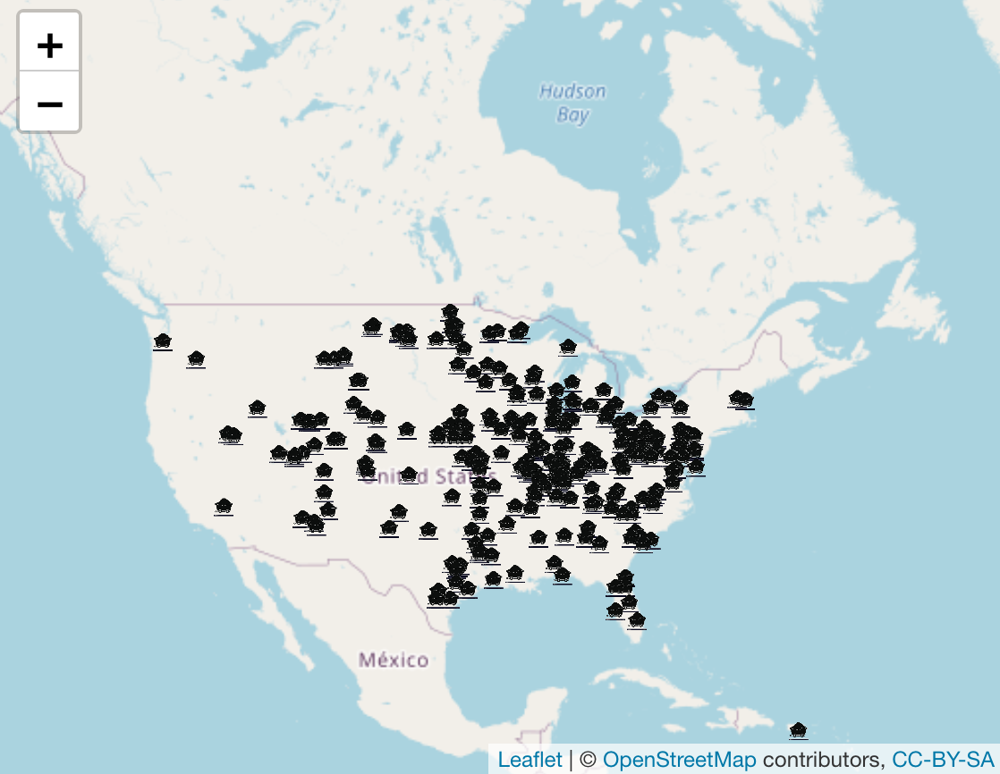
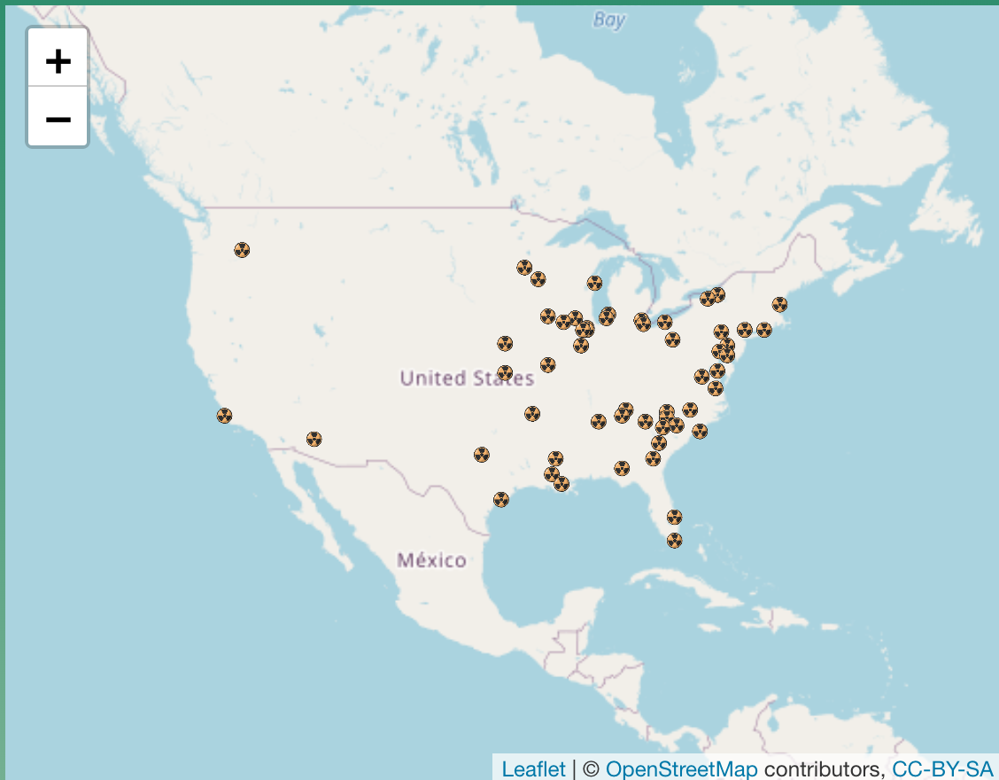
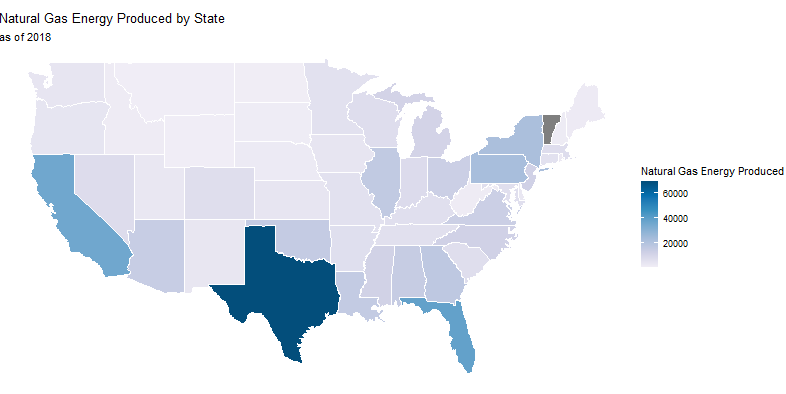
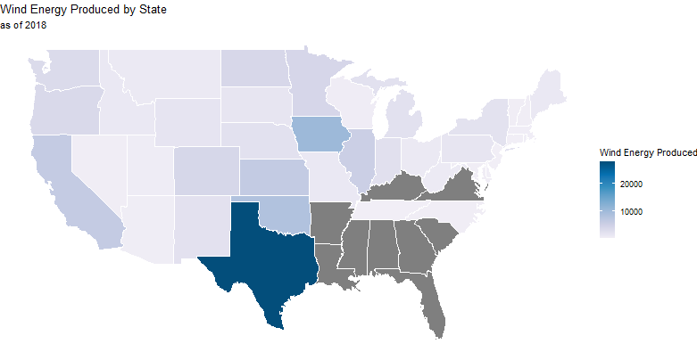
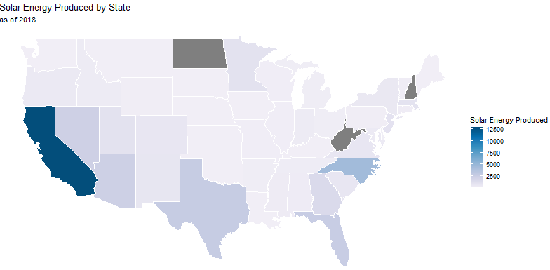

```{r setup, include=FALSE}
knitr::opts_chunk$set(echo = TRUE, fig.align="center")
library(tidyverse)
```

# Introduction to Energy Usage


With climate change being one of the most pressing issues of our generation, finding ways to combat this enormous problem is going to require a bunch of system level changes all happening at the same time in order to mitigate the negative effects. Currently one of the biggest transformations that is going to be required to reduce the total amount of carbon emissions, especially here within the United States, is finding a way to transition the country towards renewable energy and cutting back on fossil fuels.  
  
  
While the country has been slowly adopting more and more renewable energy types over the past couple of decades, this transition is happening very slowly and varies heavily from state to state. By performing a deeper analysis on a state by state level of the types of energy stations that are present, how much CO2 each state emits, and how much energy each state consumes and produces, we can use these insights to inform policy decisions and find areas that could be used to expand the production of different renewable energy types. 


## Our Questions



By building off our mid semester project, we wanted to advance our work and look closer at the distribution of different energy production types and the amount of energy they produce in relation to CO2 production.Ultimately through our different visualizations we are hoping to be able to answer questions such as how can identifying locations and outputs of renewable energy decisions influence policy decisions? How can the insights we find lead to reducing Co2 emissions within different states? What sorts of renewable energies are already present within different states and how can that help lead to what sorts of renewable energies get adopted in the future? How has the adoption of renewable and nonrenewable energies changed overtime? Understanding how different energy types are used and produced in different states would provide useful information to policy makers and energy companies in helping them figure out the best way to use their time and resources.


## Data

To answer these questions, we collected data from the U.S. Energy Information Administration.  The EIA has data that spans from before 1960 all the way to 2021, but the data we most wanted to focus on was for power plants in the US, of which only data from 2018 was available. We were able to find data on power plant location and generation capacity for the major renewable and nonrenewable energy sources including wind, solar, hydroelectric, geothermal, nuclear, coal, petroleum, and natural gas. Included was information on carbon dioxide emissions by state and per capita, as well as energy consumption by state.

# Energy Usage Statistics & Analysis


## Energy production in the United States



When discussions about adjusting to more sustainable energy sources, there are often arguments of costs and inefficiencies of renewable energy power plants. Making a decision on what type of renewable energy sources will be the most effective and sustainable while moving away from nonrenewable energy sources is often challenging. We wanted to see the total energy production from each individual energy source in the US in 2018. From the graph above, we see that natural gas, coal, and wind produce the highest amount of energy in the US respectively. The lowest energy production was from geothermal and petroleum. It was interesting to see that petroleum actually had lower energy production than solar (We expected the opposite).




We also thought that it would be interesting to examine the “efficiency” of each energy type. This was to see which energy type produced the most energy per plant. To calculate efficiency, we divided the total energy produced per type with the number of available power plants. Nuclear energy was the most efficient, followed by coal. Despite having the highest total energy produced, natural gas was not the most efficient. Solar, petroleum and geothermal energy power plants were the least efficient.
In the sense that we are talking about efficiency, we mean that only small amounts of energy are produced at the least "efficient" plants, while large amounts are produced at the most "efficient" plants, not that a type of energy production is necessarily able to utilize more of the available energy from that resource.

## Leaflet Plots {.tabset .tabset-fade .tabset-pills}

### Wind Plot




### Coal Plot



### Nuclear Plot




## Leaflet Results

From the leaflet maps above, we can start to get an understanding of where exactly different types of energy stations are located within the United States. While the above plots are just three examples taken from the Shiny App we created, in the Shiny App itself one has the ability to choose the energy type they are interested in, or even choose multiple energy types at the same time. These maps are interactive and one can zoom into any particular state or location, and a user can also click on any individual symbol and get the name of the plant, the exact location, and how much energy that plant produces. Also shown in the shiny app is higher level state summary information. The user has the ability to pick any particular state they are interested in and can see how much energy is generated by the different energy types within the state, and also how many of the different plants are currently within the state.

In particular if we analyze just these three plots above, we can start to see how when looking at the first plot of wind stations within the US, that there is a high number concentrated in the Midwest region but not many exist within the South. When looking at the Coal plot, we can start to see how coal plants are heavily located within Rust Belt region, and that there are not many coal plants on the West Coast. Finally when looking at the Nuclear plot, we can see that overall there is much lower number of nuclear plots within the United States and the ones that are currently running are located primarily along the East Coast. While the Shiny App can offer us even further in depth analysis when combining the leaflet plots with the summary tables, these are just a few of the high level insights we can gain from the plots alone. 


## Choropleth Maps {.tabset .tabset-fade .tabset-pills}

### Natural Gas



### Wind 



### Solar



## Choropleth Results

In addition to looking at energy within the United States as a whole and on the per plant level, we decided that looking at renewable and nonrenewable energy production in each state would provide valuable information on state’s adoption of renewable energy sources. Some states have much higher adoption rates of renewable energy. Looking at energy production in each state can provide information as to which states should focus on increasing adoption of renewable energy and reducing usage of fossil fuels. In the choropleth map above looking at natural gas power plants in the United States, we can see that Texas, California, and Florida produce a massive amount of energy by burning natural gas. While “cleaner” than coal or petroleum, natural gas power plants still emit greenhouse gases, from 50-60% of the emissions of a coal plant. While the emissions are lower on a per plant basis, natural gas usage in the US is much greater than coal or petroleum, meaning emissions are going to be larger.

The second choropleth from our Shiny App is energy from wind. While other types of renewable energy such as hydroelectric and geothermal can be limited in the number of places plants can be built, wind turbines can be built across the US. While some states such as Florida and Mississippi have little wind, many of the others have enough wind to justify the building of wind turbines to harness some of this energy. Texas has jumped on this alternative energy source, with turbines producing about a third of the energy that natural gas produces. Texas has adopted wind power, but in the recent winter storm many of the wind turbines in Texas froze over and quit working. This was due to cutting costs and not weatherproofing the turbines..Some people have concerns over pollution that wind turbines cause, environmental pollution as well as noise and visual pollution. In addition, they can have adverse effects on wildlife such as birds and bats, killing them if they are hit by the blades. These cons of wind turbines can be fixed by advances in technology and correct placement of wind farms. On top of the concerns mentioned, wind is sporadic. Reduction in generating capacity on some days could be detrimental if wind was the sole source of energy. Storage of wind energy in large batteries or coupling wind energy with another renewable source such as nuclear or solar power could up the efficacy of widespread adoption of wind power in more states.

As seen in the third choropleth, solar energy is highly underutilized. The US government estimates that 22,000 square miles of solar panels would supply enough electricity to power the entire United States. They can also be installed on rooftops with little environmental impact. Since 2014, costs for the panels have decreased by over 70%, with increases in efficiency being researched and developed. 

## Link to Shiny App

https://gchickering21.shinyapps.io/FinalShinyApp/


# Conclusion


As it stands, most of the nonrenewables are the most “efficient” energy sources. Nuclear and coal produced the most energy per power plant. Even though natural gas produced the most energy in total, it produced less energy per power plant on average. Wind was the renewable energy with the highest produced energy as well as the most efficient.When looking at the leaflet section, these plots allow us to identify key locations across the country where certain renewable energies and other energy types are more prevalent. We can also start to identify how much energy is actually produced from the different energy types and how this varies across states. When looking at the choropleth maps we can start to see how only a few states seem to have adopted a large amount of renewable energy, including Texas and California, but on the other hand, both of these states also produce a vast amount of energy using nonrenewable resources. Solar, nuclear and wind power are greatly underutilized, while natural gas, while cleaner than the other two fossil fuels that we looked at, is still a major contributor to energy production in the United States.

From this work, we can start to see how different energy types are produced at drastically different rates across the country. Our visualizations also highlight how while renewable energy is starting to be adapted more across the country, there is still a high reliance on different fossil fuel types and still produce a very large percentage of our total energy in the country. These insights that we've found could be combined to help policy makers identify areas where different renewable energies are more likely to be adapted. On the flip side these visualizations highlight where there are key areas where different types of renewable energy could be adapted in certain locations where they are certainly very utilized. 


## Future Work


While we believe our work builds a good foundation in understanding how different energy types are produced and used across different states, there is certainly future work that could be done. If given the opportunity some of the work that we think would be interesting to look into is to look at how and compare how many new energy stations have been built in recent years, and if the number of stations that are built each year remains constant or changes over time. We hope that this number would be more exponential rather than linear, as we think that there is lots of room for growth in the renewable energy field, in implementation of new plants as well as increases in efficiency. We also think it would be interesting to connect this data analysis to different types of policy work that is being done across the country and see how that influences why certain energy types do or don’t get built in certain states and locations. 


## Sources 


https://www.ucsusa.org/resources/environmental-impacts-natural-gas
https://www.wind-watch.org/news/2014/05/19/ask-hutch/
https://www.energysage.com/about-clean-energy/wind/pros-cons-wind-energy/
https://news.energysage.com/what-are-the-most-efficient-solar-panels-on-the-market/
https://www.energy.gov/eere/solar/solar-energy-united-states